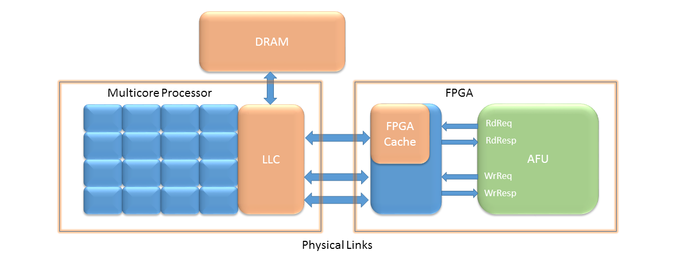

## rapid-design-methods-for-developing-hardware-accelerators

## Introduction
This project includes code and documentation to help software programmers and hardware engineers efficiently use platforms that include multi-core servers and FPGAs.


One challenge in using such systems is to effectively utilize the resources of the FPGA given the bandwidth and latency specifications imposed by this system. The link between the Accelerator Functional Unit (AFU) and the rest of the system is limited (at least) by the clock frequency and bit width of the interface. Read latency for items requiring DRAM access can be scores to hundreds of times slower than the FPGA clock frequency. Our design methodology can help you develop applications that successfully hide this latency and utilize the link at full system bandwidth.

We use SystemC to express the parallelism available in the AFU, and rely on commerical High-Level Synthesis (HLS) tools to map this hardware description to Verilog (needed by the FPGA Synthesis, Place and Route tools.) We provide code generation flows to enable new SystemC users to become proficient quickly. Standardized memory interfaces (optimized for streaming and also random access patterns) are also provided, and well as schemes for creating multiple parallel AFUs that interface to the same (single) memory system.

After describing the process graph in a DSL, you need to write code like this to complete the functionality of a vector addition accelerator.
```cpp
void fetcher() { //generated
  inaRespIn.reset_get(); //generated
  inbRespIn.reset_get(); //generated
  outDataOut.reset_put(); //generated

  unsigned int ip = 0;

  done = false; //generated

  wait(); //generated
  while (1) { //generated
    if ( start) { //generated
      if ( ip != (config.read().get_n() >> 4)) {
        MemTypedReadRespType<Blk> wrapped_cla = inaRespIn.get();
        MemTypedReadRespType<Blk> wrapped_clb = inbRespIn.get();

        MemTypedWriteDataType<Blk> wrapped_clo; 

      UNROLL:
        for( unsigned int j=0; j<16; ++j) {
          wrapped_clo.data.words[j] = wrapped_cla.data.words[j] + wrapped_clb.data.words[j];
        }

        ++ip;
 
        outDataOut.put( wrapped_clo);

      } else {
        done = true;
      }
    } //generated
    wait(); //generated
  } //generated
} //generated
```
In all, more than 700 lines of SystemC intrastructure code is generated from less than 90 lines of process graph specification and kernel code.


## Quickstart
Download SystemC and Googletest, compile and install.

Set environment variables `SC_DIR`, `GTEST_DIR`, and `HLD_ROOT`.

`cd $HLD_ROOT/tutorials/memcpy/systemc; make`

## References and Help
See the [Wiki](https://github.com/intel/rapid-design-methods-for-developing-hardware-accelerators/wiki) for tutorials and more documentation.

File an [Issue](https://github.com/intel/rapid-design-methods-for-developing-hardware-accelerators/issues) for questions and bug sightings.

This design infrastructure is a component of [Intel's Hardware Accelerator Research Program V2](http://www.sigarch.org/2016/09/28/call-for-submissions-intel-hardware-accelerator-research-program-v2/)

## License

Copyright (c) 2016, Intel Corporation
All rights reserved.

Redistribution and use in source and binary forms, with or without modification, are permitted provided that the following conditions are met:

1. Redistributions of source code must retain the above copyright notice, this list of conditions and the following disclaimer.

2. Redistributions in binary form must reproduce the above copyright notice, this list of conditions and the following disclaimer in the documentation and/or other materials provided with the distribution.

3. Neither the name of the copyright holder nor the names of its contributors may be used to endorse or promote products derived from this software without specific prior written permission.

THIS SOFTWARE IS PROVIDED BY THE COPYRIGHT HOLDERS AND CONTRIBUTORS "AS IS" AND ANY EXPRESS OR IMPLIED WARRANTIES, INCLUDING, BUT NOT LIMITED TO, THE IMPLIED WARRANTIES OF MERCHANTABILITY AND FITNESS FOR A PARTICULAR PURPOSE ARE DISCLAIMED. IN NO EVENT SHALL THE COPYRIGHT HOLDER OR CONTRIBUTORS BE LIABLE FOR ANY DIRECT, INDIRECT, INCIDENTAL, SPECIAL, EXEMPLARY, OR CONSEQUENTIAL DAMAGES (INCLUDING, BUT NOT LIMITED TO, PROCUREMENT OF SUBSTITUTE GOODS OR SERVICES; LOSS OF USE, DATA, OR PROFITS; OR BUSINESS INTERRUPTION) HOWEVER CAUSED AND ON ANY THEORY OF LIABILITY, WHETHER IN CONTRACT, STRICT LIABILITY, OR TORT (INCLUDING NEGLIGENCE OR OTHERWISE) ARISING IN ANY WAY OUT OF THE USE OF THIS SOFTWARE, EVEN IF ADVISED OF THE POSSIBILITY OF SUCH DAMAGE.

## Contributors

[Andrey Ayupov](http://github.com/aayupov)

[Steven Burns](http://github.com/stevenmburns)
